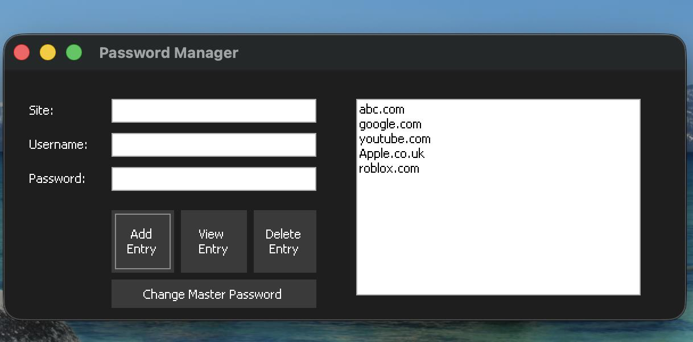
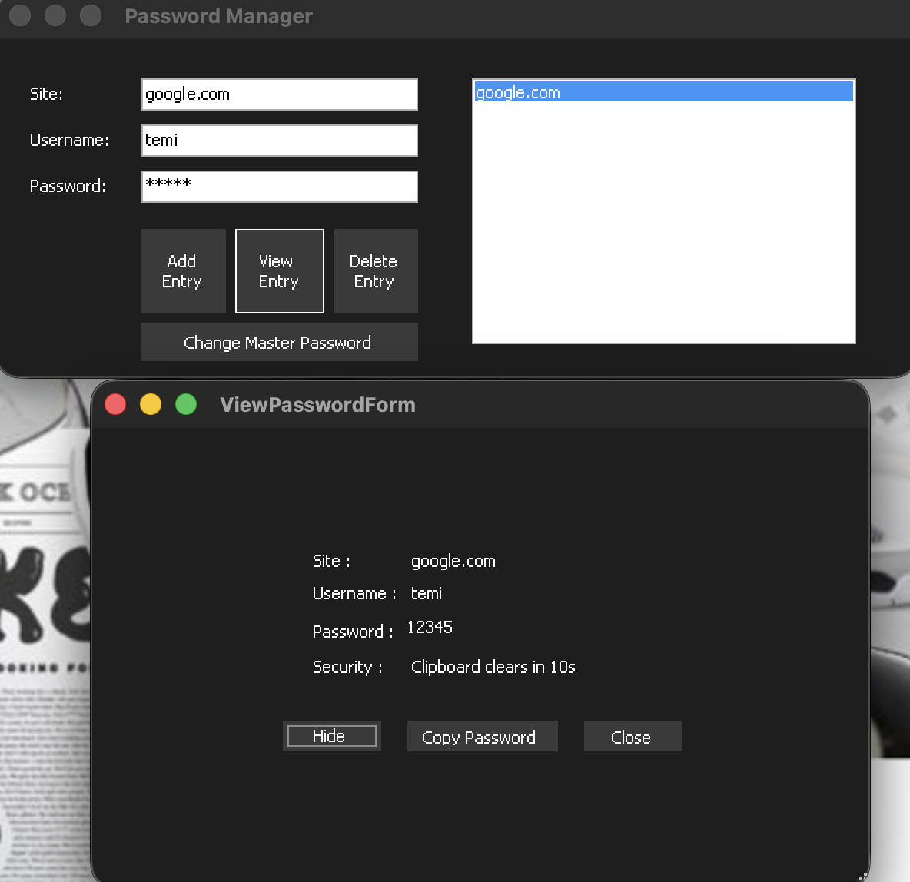
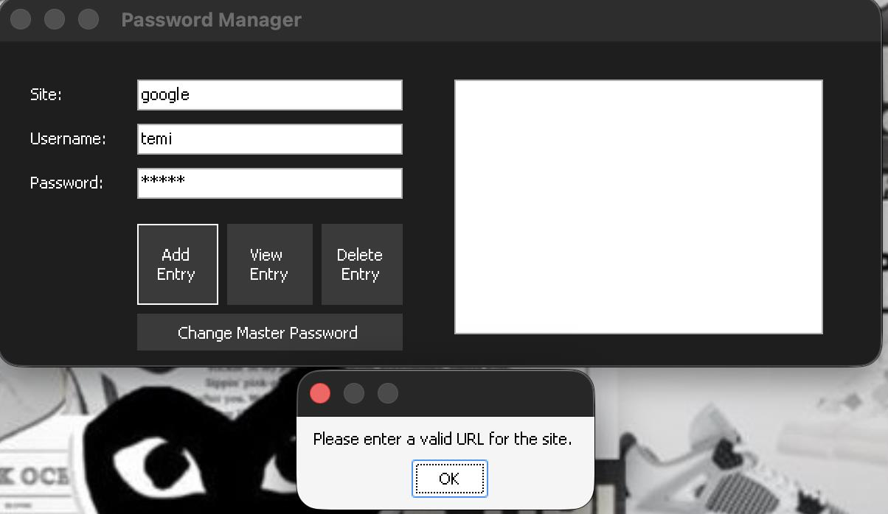
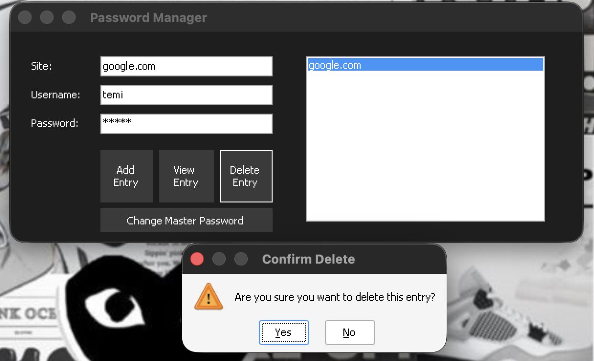

# SecureVault

A local, offline password manager built in C# with Windows Forms on .NET 8. It stores website logins in a single encrypted file on the user's own machine, protected by one master password. There is no cloud sync and no account system: everything lives on disk, encrypted, and never leaves the device.

Originally built as A-Level Computer Science coursework (NEA). The full coursework report, including the research, design decisions and testing behind it, is in [`docs/NEA-Report.pdf`](docs/NEA-Report.pdf). A shorter technical write-up of how it works is in [`docs/SecureVault-Technical-Overview.pdf`](docs/SecureVault-Technical-Overview.pdf).

## What it does

- Creates a master password on first run, enforcing a minimum policy, and verifies it on every run after that.
- Adds, views and deletes entries for individual sites (site, username, password), with the site checked against a URL pattern before it is accepted.
- Requires the master password to be re-entered before any stored password is shown.
- Shows a stored password masked by default. A Show button reveals it for 10 seconds, then it re-masks itself. It also re-masks the moment the window loses focus.
- Copies a password to the clipboard and clears it again 15 seconds later, but only if the clipboard still holds what was copied, so anything the user copied in the meantime is left alone.
- Locks out further login attempts with a wait that doubles after each failure, up to five minutes, and remembers the lockout across restarts.
- Changes the master password after verifying the old one.
- Dark theme applied across every window.

## Screenshots

| Main window | Viewing an entry |
|---|---|
|  |  |

| Site validation | Deleting an entry |
|---|---|
|  |  |

## Why it's built this way

The design followed research comparing this approach against existing tools (KeePass, Bitwarden, 1Password and LastPass, covered in the report). The conclusion was that a fully local vault removes an entire category of risk that cloud-synced password managers carry: a breach of someone else's server. The trade-off, no access from another device, was accepted deliberately.

The security-relevant choices:

- **Master password hashing and key derivation: PBKDF2 with HMAC-SHA256, 100,000 iterations by default.** The master password is never stored. `master.dat` holds a random 16-byte salt, the iteration count, and a verifier, which is the SHA-256 of the derived AES key rather than the key itself. Reading the file gives an attacker the verifier, not the key, so recovering the key still means guessing the password through PBKDF2. Because the count is stored, it can be raised for new vaults without breaking old ones.
- **AES-256 for each stored entry, individually.** Every entry is encrypted on its own with a freshly generated initialisation vector, rather than encrypting the whole vault as one block. Identical passwords stored for two different sites do not produce identical ciphertext, and a corrupted entry does not take the others with it.
- **Constant-time comparison for password verification**, using `CryptographicOperations.FixedTimeEquals`, so the time taken to reject a wrong password does not leak how close it was. Earlier versions carried a hand-written equivalent from before the move to .NET 8.
- **Exponential backoff on failed logins**, handled by `LockoutManager`: 5 seconds after the first failure, doubling each time, capped at 300 seconds. The failure count and timestamp are written to `lockout.dat`, so closing and reopening the application does not reset the wait.
- **A minimum password policy** in `SecurityPolicy`: at least 10 characters, at least one uppercase letter, one lowercase letter, one digit and one symbol, and a block on a few obviously common substrings. Enforced on the initial master password and on any later change.
- **Master password changes re-encrypt the vault.** Because entries are already decrypted in memory, `MainForm` re-saves the vault under the new key in the same operation, so nothing is orphaned under the old one.
- **Re-authentication before reveal.** Viewing a stored entry opens `ConfirmPasswordForm` first, which verifies the master password against the stored hash before `ViewPasswordForm` is shown.
- **Clipboard and screen hygiene** in `ViewPasswordForm`: the password field is read-only with keyboard shortcuts disabled, reveals are time-limited, the field re-masks on focus loss, and the clipboard is cleared on a timer.

## Known limitations

Found by reading the code back after the fact, and recorded here rather than left to be discovered.

- **The rotating session key is never used.** `MainForm` derives a new `sessionKey` every 30 seconds and logs its fingerprint to the console, but all vault encryption and decryption uses `masterKey`. The rotation has no effect on security in the current version.
- **A label is out of date.** `ViewPasswordForm` displays "Clipboard clears in 10s" while the timer is set to 15 seconds. The timer was lengthened after usability testing (recorded in the report) and the label was not updated.
- **Secrets are held in `string`.** .NET strings are immutable and cannot be securely wiped, so decrypted passwords remain in memory until garbage collection even after `SecureCleanup` clears the on-screen field.
- **A `|` character in a username or password corrupts the entry.** Entries are stored as `site | username | password` and split on `|` when read back, so a password containing that character is cut short when viewed. A structured format, or escaping the delimiter, would fix it.

### Fixed in 3.1

These were found in the same review and fixed in the commit after Version 3. They are kept here because they are the more instructive part of the project's history.

- **The login verifier stored on disk was the vault encryption key.** `HashPassword` and `DeriveEncryptionKey` ran the identical PBKDF2 computation, so the 32 bytes written to `master.dat` were the AES key, and anyone holding both files could decrypt the vault with no guessing. Fixed by storing SHA-256 of the key as the verifier. Existing vaults are migrated to the new layout automatically on their next successful login.
- **Changing the master password orphaned the vault.** A new salt and verifier were written but `passwords.dat` stayed encrypted under the old key. Fixed by re-encrypting the in-memory entries under the new key as part of the change.
- **The PBKDF2 iteration count was not stored**, so it could never be raised. It is now written to `master.dat` and read back at login.
- **The hand-written constant-time comparison** was replaced with `CryptographicOperations.FixedTimeEquals`.

## Project structure

```
SecureVault/
├── LICENSE
├── README.md
├── docs/
│   ├── NEA-Report.pdf                        the full coursework write-up
│   ├── SecureVault-Technical-Overview.pdf    how it works, in plain terms
│   └── screenshots/
└── src/
    ├── SecureVault.sln
    └── SecureVault/
        ├── SecureVault.csproj             .NET 8, Windows Forms
        ├── Program.cs                     entry point: login first, then the vault
        ├── LoginForm.cs                   master password creation and verification
        ├── MainForm.cs                    add, view and delete entries; vault file I/O
        ├── ViewPasswordForm.cs            masked display, timed reveal, clipboard copy and clear
        ├── ConfirmPasswordForm.cs         re-authentication before a reveal
        ├── ChangePasswordForm.cs          master password change
        ├── PasswordUtils.cs               PBKDF2, verifier, AES-256, master.dat I/O
        ├── LockoutManager.cs              exponential backoff, persisted in lockout.dat
        └── SecurityPolicy.cs              password complexity rules
```

Each form has a matching `.Designer.cs` file holding the Visual Studio generated layout code.

## Running it

Windows only, since it is a Windows Forms application. You need the .NET 8 SDK.

With Visual Studio 2022: open `src/SecureVault.sln`, build, and run.

From the command line:

```
cd src/SecureVault
dotnet run
```

On first launch, entering a master password that meets the policy creates the vault. On later launches, the same password unlocks it.

The three data files (`master.dat`, `passwords.dat`, `lockout.dat`) are created in the working directory at runtime and are not part of the repository, since they hold whichever passwords the person running it chooses to store.

## Development history

Built and tested in three stages, each adding to the last:

- **Version 1 (Beta):** the core login and entry flow, on .NET Framework 4.7.2.
- **Version 2:** master password change, plus the move to PBKDF2 and AES-256 in place of earlier, simpler storage. The constant-time comparison was hand-written at this stage because the framework did not provide one.
- **Version 3:** delete entry, a dedicated view window with timed reveal and clipboard clearing, URL validation on the site field, and the dark theme. Moved to .NET 8.
- **Version 3.1:** security fixes from a code review of Version 3, listed above. The `master.dat` format changed, with automatic migration.

The repository's first commit was Version 2. Version 3 was reconstructed from the source listing in the coursework report's appendix and committed on top, and 3.1 followed as a separate commit, which is why the history is three commits rather than a running log.

The full iterative testing record, including issues found and fixed along the way, is in the report.

## License

MIT. See [LICENSE](LICENSE).
