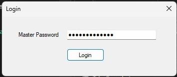
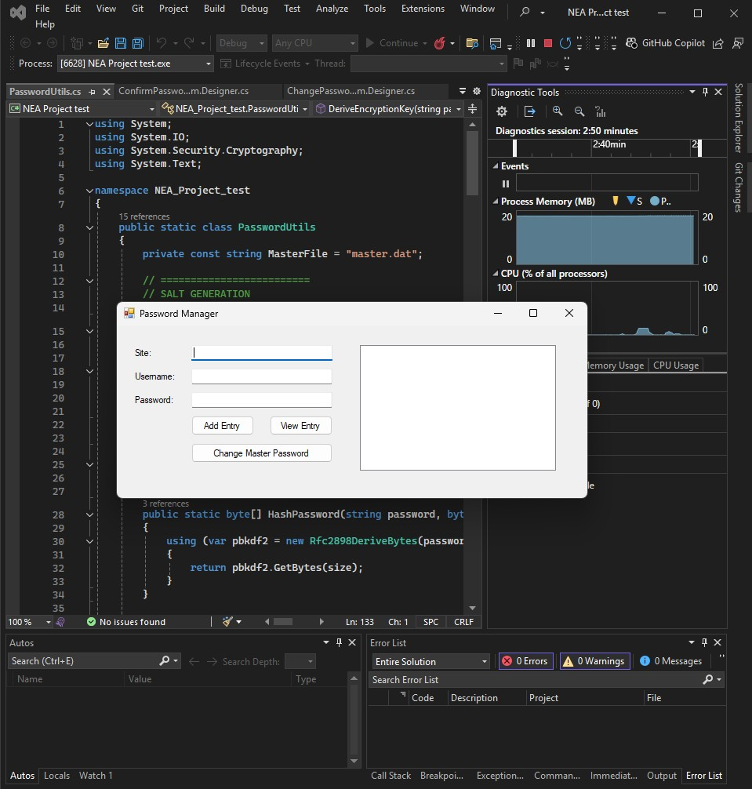
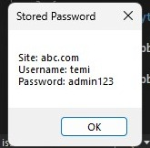
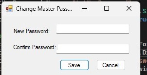

# SecureVault

A local, offline password manager built in C# (Windows Forms, .NET Framework 4.7.2). It stores website logins in a single encrypted file on the user's own machine, protected by one master password. There is no cloud sync and no account system: everything lives on disk, encrypted, and never leaves the device.

Originally built as A-Level Computer Science coursework (NEA). The full coursework report, including the research, design decisions and testing behind it, is in [`docs/NEA-Report.pdf`](docs/NEA-Report.pdf).

## What it does

- Creates and verifies a strong master password on first run.
- Adds, views and deletes encrypted entries for individual sites (site, username, password).
- Copies a password to the clipboard, then clears the clipboard automatically after 15 seconds.
- Locks out further login attempts with an increasing delay after repeated failed master password attempts.
- Changes the master password without needing to reinstall or reset the app.

## Screenshots

| Login | Adding and storing entries |
|---|---|
|  |  |

| Viewing a stored entry | Changing the master password |
|---|---|
|  |  |

## Why it's built this way

The design followed a short piece of research comparing this approach against existing tools (KeePass, Bitwarden, 1Password/LastPass — covered in full in the report). The conclusion was that a fully local, offline vault removes an entire category of risk that cloud-synced password managers carry: a breach of someone else's server. The trade-off, no access from another device, was accepted deliberately in exchange for that.

The security-relevant choices:

- **Master password hashing and key derivation: PBKDF2 with SHA-256, 100,000 iterations.** The master password is never stored. What's stored is a salted hash for verifying login, and the encryption key used for the vault is derived separately from the same password using the same algorithm.
- **AES-256 for each stored entry, individually.** Every entry is encrypted on its own with a freshly generated initialisation vector, rather than encrypting the whole vault as one block. Identical passwords stored for two different sites do not produce identical ciphertext, and a problem with one entry doesn't compromise the others.
- **A hand-written constant-time comparison for password verification.** .NET Framework 4.7.2 doesn't include a built-in constant-time byte comparison (that came later, in newer .NET versions), so `PasswordUtils.FixedTimeEquals` implements one directly, comparing every byte regardless of where a mismatch occurs, to avoid leaking timing information about how close a guess was.
- **Exponential backoff on failed logins**, handled by `LockoutManager`: the wait time doubles with each consecutive failure (capped at 5 minutes), which is cheap to implement and meaningfully slows down anyone trying to guess the master password locally.
- **A minimum password policy** (10 characters, at least one uppercase letter, one lowercase letter, one digit, one symbol, and a block on a few obviously common substrings) enforced on both the initial master password and any later change.

## A known limitation

Changing the master password (`ChangePasswordForm`) re-hashes the new password and updates the stored salt, but it does not re-encrypt the existing entries under a new key. In the current version, entries saved before a master password change will not decrypt correctly after one. The fix is straightforward, decrypt everything with the old derived key before the change, re-encrypt with the new one, but it isn't implemented yet. Noting it here rather than leaving it to be discovered.

## Project structure

```
SecureVault/
├── LICENSE
├── README.md
├── docs/
│   ├── NEA-Report.pdf        the full coursework write-up: research, design, testing, evaluation
│   └── screenshots/          the application in use
└── src/
    ├── SecureVault.sln
    └── SecureVault/
        ├── Program.cs                entry point
        ├── LoginForm.cs              master password creation and verification
        ├── MainForm.cs                add / view / delete entries
        ├── ChangePasswordForm.cs      master password change
        ├── ConfirmPasswordForm.cs     re-authentication before revealing a stored password
        ├── PasswordUtils.cs           hashing, key derivation, AES encryption/decryption
        ├── LockoutManager.cs          exponential backoff after failed logins
        ├── SecurityPolicy.cs          password complexity rules
        └── Properties/
```

## Running it

This is a .NET Framework 4.7.2 Windows Forms app, so it needs Windows and Visual Studio (or the MSBuild tools for .NET Framework) to build.

1. Open `src/SecureVault.sln` in Visual Studio.
2. Build the solution (Build → Build Solution, or `Ctrl+Shift+B`).
3. Run it (`F5`). On first launch, entering a master password that meets the policy creates the vault; on later launches, the same password unlocks it.

The vault files (`master.dat`, `passwords.dat`, `lockout.dat`) are created next to the built executable at runtime and are not part of the repository, since they hold whichever passwords the person running it chooses to store.

## Development history

Built and tested in stages, each one adding a feature and re-testing what came before it:

- **Version 1 (Beta):** the core login and entry flow.
- **Version 2:** master password change, plus the move to proper encryption and hashing (PBKDF2 and AES-256) in place of earlier, simpler storage.
- **Version 3:** delete entry, an expanded view for a stored entry, and a dark theme.

The full iterative testing log, including issues found and fixed along the way (an `EndOfStreamException` when reading a corrupted `master.dat`, the missing constant-time comparison mentioned above, the clipboard clear timer starting too short at 10 seconds and being lengthened to 15 after usability testing), is in the report.

## License

MIT. See [LICENSE](LICENSE).
